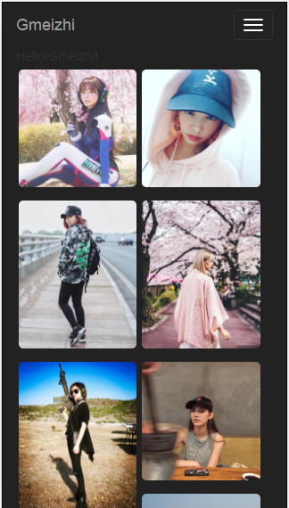

# Gmeizhi1
刚刚开始学习react一个练手项目 

本项目运用了： 
1.es6 
2.react-router@4.0 
3.Waterfall瀑布流react插件(PS:由于我接口的数据跟这个插件要求的数据结构不一样，所以稍微改了下这个插件) 
4.react-bootstrap 

# 感谢
* [妹纸.gank.io](https://github.com/drakeet/Meizhi)提供的妹纸接口

